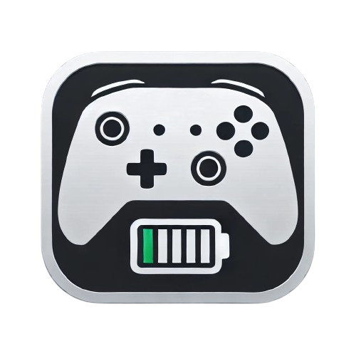

<div align="center">
 
</div>

# XBatteryMonitor (XBM)

[](https://dotnet.microsoft.com/download/dotnet/8.0)
[](LICENSE)
[](https://github.com/dikayx/xbatterymonitor/releases)

XBM is a small companion app for Windows that monitors the battery level of your gamepad and sends a notification when it's low. It's designed to work with the Xbox controller, but supports any gamepad that uses the XInput API. Basically it fulfills the job that the Xbox Accessories app should have done.

> **Note**: This project is in its early stages and may contain bugs. Please report any issues you encounter.

## Features

-   **Low battery notification**: Get a notification when your gamepad's battery is low.
-   **Customizable**: Set the battery level and interval at which the notification is triggered.
-   **Lightweight**: Consumes very little resources.

## Installation

~~It's simple! Download the latest release from the [releases page](https://github.com/dikayx/xbatterymonitor/releases) and run the installer.~~

Currently, this app is in active development. You can build it yourself by cloning the repository and running the following command:

```cmd
git clone https://github.com/dikayx/xbatterymonitor && cd xbatterymonitor && dotnet build
```

### Requirements

-   Windows 10 or later
-   [.NET 8 Runtime](https://dotnet.microsoft.com/download/dotnet/8.0)

## Usage

By default, XBM will start with Windows and run in the background. You can access the settings by right-clicking the tray icon.

## License

The code for this project is licensed under the MIT License. See the [LICENSE](LICENSE) file for details.

## Acknowledgements

Xbox and Xbox Game Bar are trademarks of Microsoft Corporation. This project is not affiliated with Microsoft.
